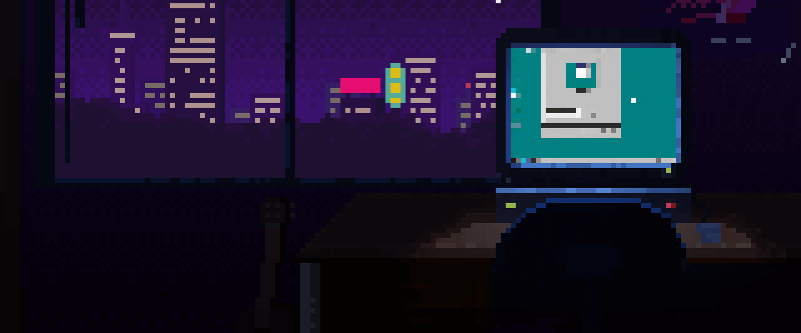

# 🖖 Hey dev! Welcome to my profile 

I'm a Network engineer !

I'm junior Network Engineer and python developer =>

 
<a href="https://jobinja.ir/user/mahanabedini">Persian Resume</a>  
<a href = "https://s6.uupload.ir/files/english_resume_nll6.jpg">English Resume</a>

What made me fall in love with networking is the ability to design and build systems that feel like art.  
Every time I draw a topology, configure routers and switches, or bring a complex network to life from scratch, it feels like I’m creating art with protocols and code.  

## 👨🏻‍💻 About me
 

- 🌎 I'm from Earth - Iran/Tehran
- 👨🏻‍💻 Love python , Netowrk senarios ,data mining & network security
- 🧠 Love learning 
- 🚀 Passionate for Success 
- ✈️ Traveling is one of my favorite hobbies
- 📧 Reach me via => mahansoft81@gmail.com
 

 
 
 
 
 

## 💻 Tech stack

## 📊 Take a look in my stats

 
 
 
 
 
 
 
 

---

 
  <i>Thanks for passing by</i>  
  <i>Feel free to connect with me</i>  
  <a href="https://www.linkedin.com/in/mahanabediny/">
  <code></code>
</a>
  
<a href="https://instagram.com/pvv_mahan">
<code></code>
   
 
        
   <a href="https://bio.link/mahanabedini">🔗Mahan Abedini</a>
</a>

